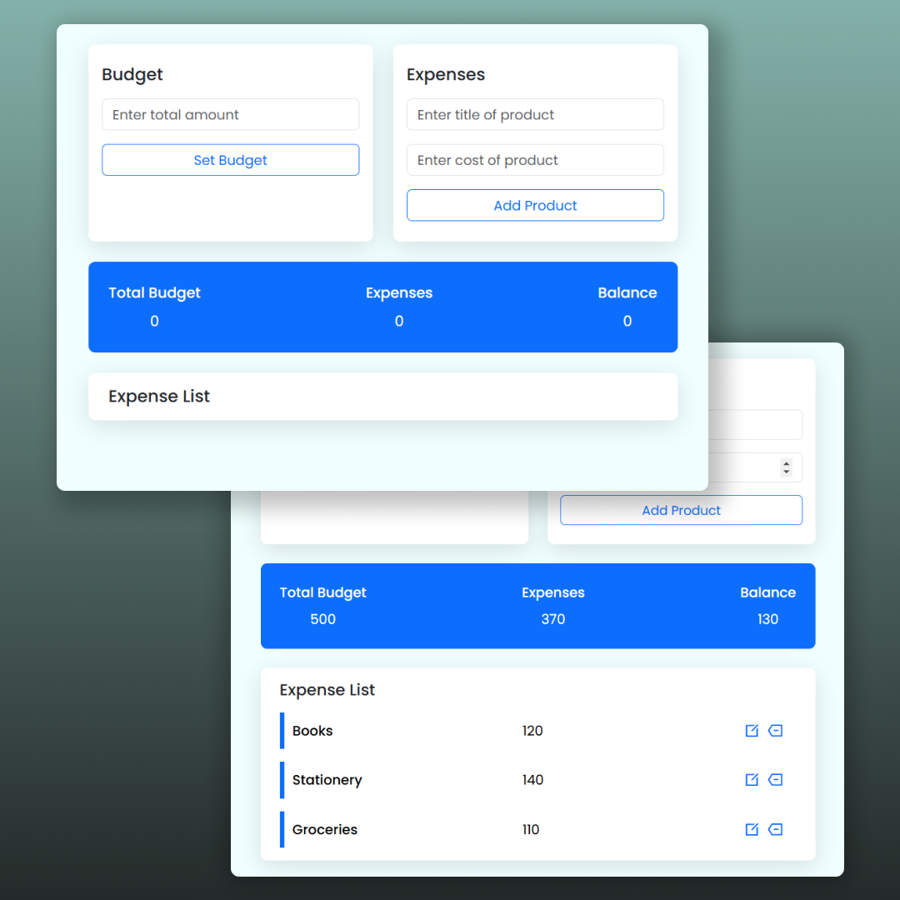

# Budget Tracker

A simple Budget Tracker application that allows users to set a budget, track their expenses, and calculate the remaining balance. Users can add, edit, and delete expense items, with real-time updates on the budget, expenses, and balance.

## Features

- Set a total budget
- Add, edit, and delete expense items
- View the total budget, total expenses, and remaining balance in real-time

## Technologies Used

- HTML for the structure
- CSS (with Bootstrap) for styling
- JavaScript for functionality

## File Structure

```bash
/budget-tracker
  ├── index.html          # Main HTML file
  ├── style.css           # Custom CSS styles (if applicable)
  ├── app.js              # JavaScript functionality
  ├── README.md           # Project documentation (this file)
```

## Screenshot


