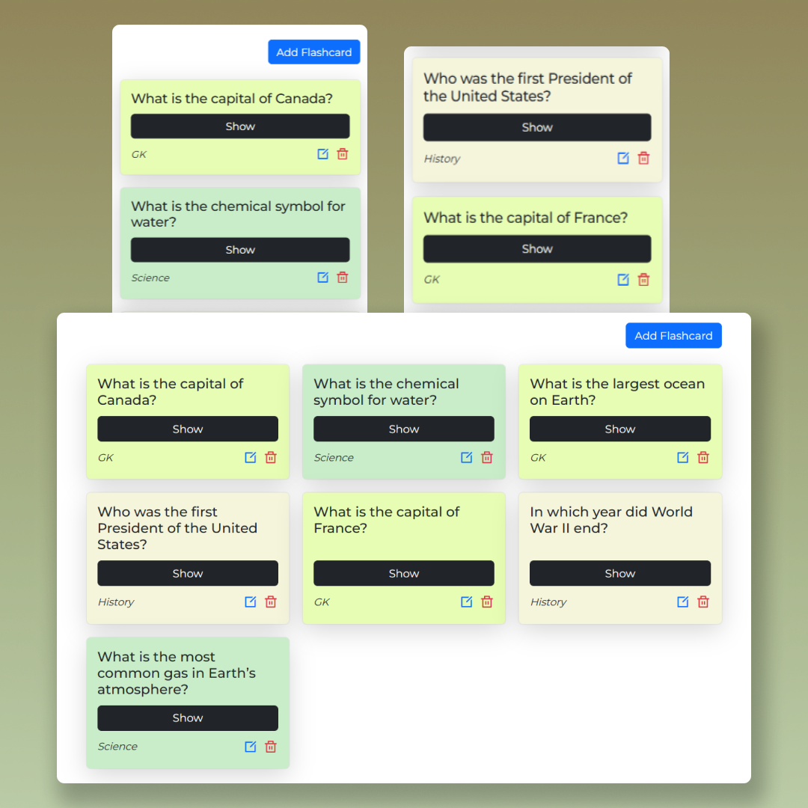

# Flashcard Web App

A simple flashcard web application that allows users to create, edit, view, and delete flashcards categorized into different topics. This app saves flashcards locally using localStorage so users can access their flashcards even after refreshing the page.

## Features

- **Create New Flashcards**: Users can input a question, an answer, and select a category to save a new flashcard.
- **Edit Flashcards**: Users can modify existing flashcards.
- **Delete Flashcards**: Users can delete flashcards when no longer needed.
- **Toggle Answer Visibility**: Users can toggle between showing or hiding the answer of a flashcard.
- **Categorization**: Flashcards are categorized into predefined categories (e.g., General Knowledge, Science, History).
- **Data Persistence**: Flashcards are saved to localStorage, allowing them to persist even after page reloads.

## Tools & Technologies Used

- **HTML**: Structure and content of the application.
- **CSS**: Styling and layout of the app.
- **JavaScript**: Application logic for handling flashcards (creating, editing, saving to localStorage, etc.).
- **Bootstrap**: Used for layout and responsive design.
- **Remix Icons**: For icons like delete, edit, etc.

## Screenshot

